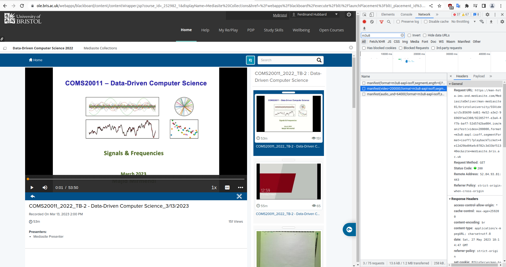

# Project Name

## Prerequisites

Before you get started, ensure that you have the following software installed on your machine:

1. [Docker](https://www.docker.com/)
2. [Bash](https://www.gnu.org/software/bash/)

## How to Setup

To set up the project, follow these steps:

1. Clone the repository to your local machine:

```sh
git clone https://github.com/ferdinandhubbard981/mediasite-download.git
```

2. Navigate to the cloned repository:

```sh
cd mediasite-download
```

3. Run the `setup.sh` script:

```sh
./setup.sh
```

If the setup was successful, you should see a message stating that a symlink has been created successfully.

## How to Run

To run the project, use the created symlink as follows:

```sh
mediasite-dl -v "video_url" -a "audio_url" -o "output_file_name.mp4"
```

## Getting Video and Audio URLs

1. go to video
2. press f12 and go to network tab
3. in the search bar above the list of packets, type "m3u8" without the quotes
4. press play on the video
5. identify the video and audio packets (in the image below, it's the second and third packets in the list respectively)
6. copy the 'request urls'


